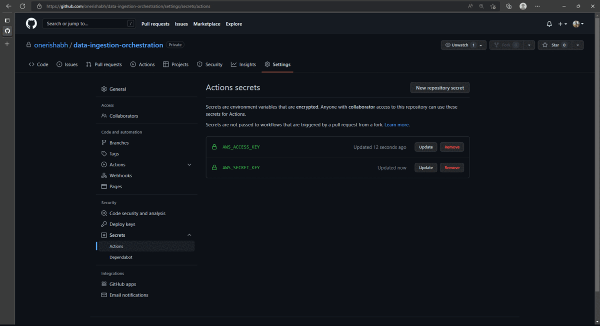
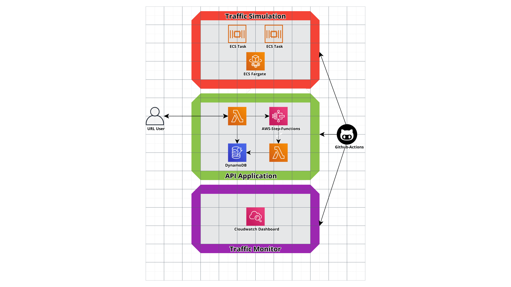
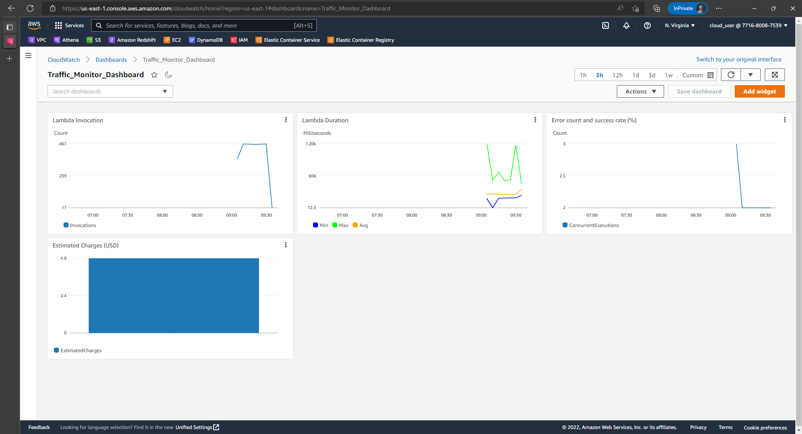

# AWS Data Ingestion Orchestration

[](https://github.com/onerishabh/data-ingestion-orchestration/actions/workflows/aws-deploy.yml) [](https://www.gnu.org/licenses/gpl-3.0)

This is a simple application that exposes `AWS Lambda Function` as a public URL. The URL is used to ingest data to an `AWS DynamoDB Table` and list items in the same table. Data is recieved via query string parameters from the URL and validated using an `AWS Statemachine`. If data is in correct format then it is ingested otherwise reponse code `400` is shared as a `PUT` response via the `AWS Lambda Function`. Data processing is done using `Python` based `AWS Lambda Function`.

The application traffic is monitored using `AWS Cloudwatch Dashboard` which tracks the `AWS Lambda Function` invocations, durations, error/success rates and `AWS Account` billings as four independent widgets.

The application is put through load-testing by simulating traffic using `AWS ECS Fargate` which runs **2** instances of `AWS ECS Tasks` *(this adds costs exponentially, so check with your organization or sandbox provider)* running custom `Docker` image. Each task hits the URL endpoint once every second using a simple shell script. The traffic can be monitored safely through `AWS Cloudwatch Dashboard`. 



# Table of Contents
  1. [AWS Architecture](README.md#aws-architecture)
  2. [Data Ingestion App](README.md#data-ingestion-app)
  3. [Traffic Simulation](README.md#traffic-simulation)
  4. [Traffic Monitor Dashboard](README.md#traffic-monitor-dashboard)
  5. [Infrastructure-as-Code](README.md#infrastructure-as-code)
  6. [Github Actions](README.md#github-actions)
  7. [Running The Application](README.md#running-the-application)

# AWS Architecture



# Data Ingestion App

The application is designed to ingest user information using query string paramaters. If query string paramters are in correct format, they are ingested into an AWS DynamoDB Table. The acceptable query string paramaters with data formats are mentioned below. 
```
- user_name: No pattern check. 
- email: Must be of (alphabet)+(alphabet|digit)*\@(alphabet|digit)+\.com
- pincode: Must be numeric with length between 4 and 6 (both inclusive)

Example : https://sd373c3bj3zedsxsjuszrfgjoy0gzceu.lambda-url.us-east-1.on.aws/?user_name=Rishabh&email=rishabh@gmail.com&pincode=3055

To list data points in table:
    https://sd373c3bj3zedsxsjuszrfgjoy0gzceu.lambda-url.us-east-1.on.aws/
```

# Traffic Simulation
There is one `AWS ECS Cluster` service which is spun to run an `AWS ECS Fargate` service. There are two tasks running concurrrently which hit `https://$FUNC_URL/?user_name=user_name=Rishabh&email=avc@gmail.com&pincode=3055` once every second each. The tasks are running on custom `Alpine` [docker-image](./load_testing/Dockerfile). 

# Traffic Monitor Dashboard
This is an `AWS CloudWatch Dashboard` meant to track load on the application. 



# Infrastructure-as-Code
The entire application has three `AWS Cloudformation` stacks: `DataIngestionInfraStack`, `LoadTesterInfraStack`, `MonitorLoadStack`. All three cloudformation stacks are deployed to `AWS` using [`AWS Cloud Development Kit`](https://aws.amazon.com/cdk/). 

This `cdk` application is a `Java` based. Make sure `node`, `aws-cdk`, `aws-cli`, `java`, `mvn` are installed on software release machine. 

# Github Actions
Make sure, `AWS_ACCESS_KEY` and `AWS_SECRET_KEY` are created/updated with valid credentials.

# Running The Application
`Fork` this respoitory and updated secrets with your `AWS` credentials.  