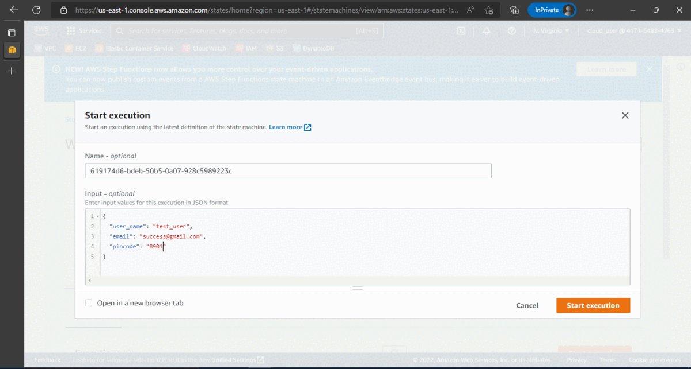

# AWS Data Ingestion Orchestration

[](https://github.com/onerishabh/data-ingestion-orchestration/actions/workflows/aws-deploy.yml) [](https://www.gnu.org/licenses/gpl-3.0) [](https://makeapullrequest.com)

This is a simple application that exposes `AWS Lambda Function` as a public URL. The URL is used to ingest data to an `AWS DynamoDB Table` and list items in the same table. Data is recieved via query string parameters from the URL and validated using an `AWS Statemachine`. If data is in correct format then it is ingested otherwise reponse code `400` is shared as a `PUT` response via the `AWS Lambda Function`. Data processing is done using `Python` based `AWS Lambda Function`.



The application traffic is monitored using `AWS Cloudwatch Dashboard` which tracks the `AWS Lambda Function` invocations, durations, error/success rates and `AWS Account` billings as four independent widgets.

The application is put through load-testing by simulating traffic using `AWS ECS Fargate` which runs **2** instances of `AWS ECS Tasks` *(this adds costs exponentially, so check with your organization or sandbox provider)* running custom `Docker` image. Each task hits the URL endpoint once every second using a simple shell script. The traffic can be monitored safely through `AWS Cloudwatch Dashboard`. 


# Table of Contents
  1. [Running The Application](#running-the-application)
  2. [Github Actions](#github-actions)
  4. [Deploying from Local System](#deploying-from-local-system)
  5. [AWS Architecture](#aws-architecture)
  6. [Data Ingestion App](#data-ingestion-app)
  7. [Traffic Simulation](#traffic-simulation)
  8. [Traffic Monitor Dashboard](#traffic-monitor-dashboard)
  9. [Infrastructure-as-Code](#infrastructure-as-code)
  10. [Future Plans/Improvements](#future-plansimprovements)

# Running The Application

## Prerequisites
* `Java` : `java -version`
* `Maven` : `mvn --version`
* `Node Package Manager` : `npm --version`
* `aws-cdk` : `npm info aws-cdk version`
* `aws-cli` : `aws-cli --version`

`aws-cli` should be configured correctly with access key and secret access key or correct keys should be supplied to [`aws-actions/configure-aws-credentials@master`](.github/workflows/aws-deploy.yml). 

The privileges of the user is primal for deploying the application to AWS. The `AWS IAM User` should have appropriate privileges for `AWS Cloudformation`. There should be an appropriate `AWS IAM Role` for deployment using CFT. 

For the context of this project, an admin `AWS IAM User` is created and `AdministratorAccess`, which is an `AWS IAM Policy` managed by `AWS` is attached to it. 

# Github Actions
Make sure, `AWS_ACCESS_KEY` and `AWS_SECRET_KEY` are created/updated with valid credentials.

Go to Actions>> .github/workflows/aws-deploy.yml >> Run Workflow

# Deploying from Local System

```
  cd data_ingestion_infra/

  # Needs to be run intially. Subsequent executions will not have any impact.
  cdk bootstrap 

  # Deploy Application
  cdk deploy DataIngestionInfraStack --require-approval never

  # Get Lambda API URL
  aws cloudformation describe-stacks \
    --stack-name DataIngestionInfraStack \
    --query "Stacks[?StackName=='DataIngestionInfraStack'][].Outputs[?OutputKey=='FunctionURLAPI'].OutputValue" \
    --no-paginate --output text

  # Deploy Traffic
  cdk deploy LoadTesterInfraStack --require-approval never

  # Deploy Monitor Dashboard 
  cdk deploy MonitorLoadStack --require-approval never
```

# AWS Architecture


# Data Ingestion App

The application is designed to ingest user information using query string paramaters. If query string paramters are in correct format, they are ingested into an AWS DynamoDB Table. The acceptable query string paramaters with data formats are mentioned below. 
```
- user_name: No pattern check. 
- email: Must be of (alphabet)+(alphabet|digit)*\@(alphabet|digit)+\.com
- pincode: Must be numeric with length between 4 and 6 (both inclusive)

Example : https://sd373c3bj3zedsxsjuszrfgjoy0gzceu.lambda-url.us-east-1.on.aws/?user_name=Rishabh&email=rishabh@gmail.com&pincode=3055

To list data points in table:
    https://sd373c3bj3zedsxsjuszrfgjoy0gzceu.lambda-url.us-east-1.on.aws/
```

# Traffic Simulation
There is one `AWS ECS Cluster` service which is spun to run an `AWS ECS Fargate` service. There are two tasks running concurrrently which hit `https://$FUNC_URL/?user_name=user_name=Rishabh&email=avc@gmail.com&pincode=3055` once every second each. The tasks are running on custom `Alpine` [docker-image](./load_testing/Dockerfile). 

# Traffic Monitor Dashboard
This is an `AWS CloudWatch Dashboard` meant to track load on the application. 
```
Note : The dip in invocations, durations and error/success rates are due to 
completion of load testing and reducing traffic on the application
```


# Infrastructure-as-Code
The entire application has three `AWS Cloudformation` stacks: `DataIngestionInfraStack`, `LoadTesterInfraStack`, `MonitorLoadStack`. All three cloudformation stacks are deployed to `AWS` using [`AWS Cloud Development Kit`](https://aws.amazon.com/cdk/). 

This `cdk` application is a `Java` based. Make sure `node`, `aws-cdk`, `aws-cli`, `java`, `mvn` are installed on software release machine. 

# Future Plans/Improvements
- [ ] Add a new Github Action that waits for a specifc amount of time after execution of aws-deploy and then tears down the LoadTesterInfraStack automatically. After all, the load testing is done only for a period of time. Current, this tear down process is manual.

- [ ] If only one of `email` or `pincode` is accpeted, then send the input to the admin asking for approval of the data point. This involves a callback state in Stepfunction. The statemachine waits until the callback is completed. The wait for callback can be anywhere upto 1 year for standard workflows. 

- [ ] A good first issue would be to update [pinger.sh](load_testing/pinger.sh) to input random but valid data points. The data points can be generated in same shell script using regex. Please feel free to contact me about more details on this. 

- [ ] Alternatively, an `AWS Kinsesis DataStream` can be setup to put `AWS DynamoDB Table` under load testing. New code for iac of kinesis data stream should be added in [LoadTesterInfraStack.java](data_ingestion_infra/src/main/java/com/myorg/LoadTesterInfraStack.java).

- [ ] Also a another good first issue would be to add an HTML template to render list of entries as single cards on a webpage. The HTML template would be used by [triggerWorkflow](lambda/triggerWorkflow/handler.py). 